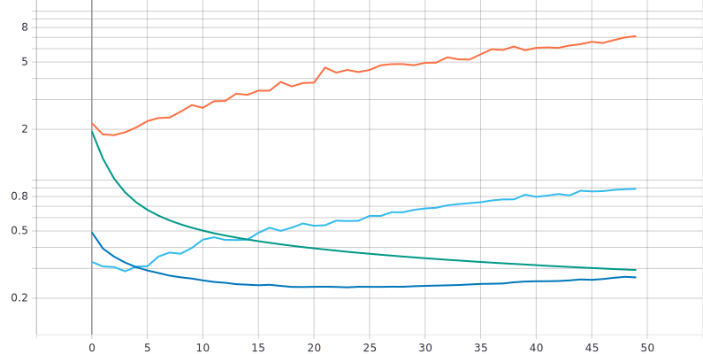
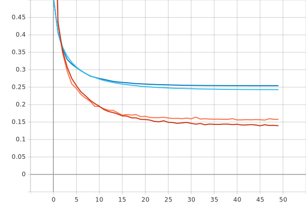

Лабораторная работа #3.
====
Изучение влияние параметра “темп обучения” на процесс обучения нейронной сети на примере решения задачи классификации Oregon Wildlife с использованием техники обучения Transfer Learning
---
1)С использованием и техники обучения Transfer Learning обучить нейронную сеть EfficientNet-B0 (предварительно обученную на базе изображений imagenet) для решения задачи классификации изображений Oregon WildLife с использованием фиксированных темпов обучения 0.1, 0.01, 0.001, 0.0001
---
Для этого задания был изменен темп обучения следующим образом:
```
optimizer=tf.optimizers.Adam(lr=0.1)
optimizer=tf.optimizers.Adam(lr=0.01)
optimizer=tf.optimizers.Adam(lr=0.001)
optimizer=tf.optimizers.Adam(lr=0.0001)
```
Графики обучения для нейронной сети EfficientNetB0(предварительно обученной на базе изображений imagenet) с использованием фиксированных темпов обучения 0.1, 0.01, 0.001, 0.0001:
---


***Линейная диаграмма точности:***


***Линейная диаграмма потерь:*** 
  

 

***Анализ результатов:***


2)Реализовать и применить в обучении следующие политики изменения темпа обучения, а также определить оптимальные параметры для каждой политики:
---
**a. Пошаговое затухание (Step Decay)**

**b. Экспоненциальное затухание (Exponential Decay)**

Для пошагового затухания использовалась функция:
```
def step_decay(epoch,lr):
  initial_lrate = 0.001
  drop = 0.5
  epochs_drop = 5.0
  lrate = initial_lrate * math.pow(drop,math.floor((1+epoch)/epochs_drop))
  return lrate
  ```
где:
* `initial_lrate = 0.001` - означает начальный темп обучения 
* `drop = 0.5` - снижение скорости обучение в 2 раза 
* `epochs_drop = 5.0` - каждые 5 эпох происходит снижение скорости обучения 

Для экспоненциального затухания использовалась функция:
```
def exp_decay(epoch,lr):
  initial_lrate = 0.001
  k = 0.1
  lrate = initial_lrate * math.exp(-k*epoch)
  return lrate
```

Также необходимо передать ***LearningRateScheduler(Планировщик скорости обучения)*** в ***callbacks(обратный вызов) - объект, который может выполнять действия на различных этапах обучения (например, в начале или в конце эпохи, до или после одной партии и т. д.).*** 
```
callbacks=[
      tf.keras.callbacks.TensorBoard(log_dir),
      LearningRateScheduler(step_decay)
    ]
```
 Была импортирована библиотека math
 ```
 import math
 ```
Графики обучения для нейронной сети EfficientNetB0(предварительно обученной на базе изображений imagenet) с использованием следующих политик изменения темпа обучения(Пошаговое затухание (Step Decay),Экспоненциальное затухание (Exponential Decay)):
---


***Линейная диаграмма точности:***


***Линейная диаграмма потерь:*** 
  

***Анализ результатов:***


